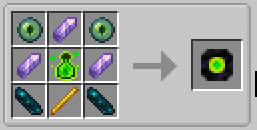
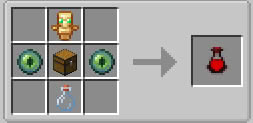

<div align="center">

# 🌟 LIFE-XP Challenge

[](https://modrinth.com)
[](https://minecraft.net)
[](https://github.com/Heysh1n/life-xp/releases)
[](https://github.com/Heysh1n/life-xp/wiki)
[](LICENSE)

*Survive, scale, and conquer. Turn your experience points into your most vital survival resource.*

</div>

---

## 📖 What is LIFE-XP Challenge?

**LIFE-XP Challenge** is a hardcore progression and survival overhaul mod for **Minecraft 26.1.1**, developed on a unified **Architectury** monorepo supporting both **Fabric** and **NeoForge** with 100% feature parity.

In vanilla Minecraft, experience levels are trivial—used merely for enchanting or anvil repairs, and mostly forgotten after reaching level 30. **LIFE-XP binds your entire physical existence to your XP bar:**

* You begin vulnerable and fragile (starting with as little as **0.5 hearts** in hardcore mode).
* Every single experience level dynamically enhances **15 player attributes** (Health, Speed, Attack Damage, Attack Speed, Toughness, Reach, Mining Speed, and more).
* Your experience functions as an active **Energy Shield**, absorbing incoming attacks before they damage your health via custom alchemy.
* Combat streaks grant exponential XP multipliers, but deaths impose a **Smart Death Tax** that heavily penalizes reckless mistakes.

---

## ✨ Key Features in v1.5.0 (The Performance Overhaul)

| Feature | Description |
| --- | --- |
| **$O(1)$ Dynamic Scaling** | 15 player attributes smoothly scale using highly optimized $O(1)$ math. No server freezes, even if you receive 50,000 levels at once. |
| **Clumps-Style XP Merging** | Mobs drop a single, high-value XP orb instead of a laggy fountain. Existing orbs merge dynamically to save server TPS. |
| **Brewable XP-Shield** | Damage drains XP before health, but only if you brew the custom **XP-Shield Potion** (up to 75% absorption). |
| **Origins-Style Presets** | First-time joiners are greeted with a mandatory, unclosable GUI to select and permanently lock their difficulty preset. |
| **Graphical HUD Bubbles** | A clean, visual overlay featuring 10 XP bubbles above the hunger bar and dynamic color-shifting vanilla level text. |
| **JEI / EMI Integration** | Full in-game documentation! View the entire XP-Shield brewing hierarchy and detailed item manuals directly in your inventory. |
| **Kill Streak Multiplier** | Up to **+100% XP (2x multiplier)** gained from killing consecutive mobs. Applied directly to the merged drops. |
| **Dynamic Visual Overlay** | XP-dependent immersive vignette and ambient ash particles at low experience levels (completely replaces legacy fog, resolving chunk culling & render distance drops). |

---

## 📦 Installation & Requirements

### System Requirements

* **Minecraft:** `26.2`
* **Java:** `25+`
* **Mod Loaders:** `Fabric Loader` or `NeoForge`

### Fabric Installation

1. Install [Fabric Loader 26.2](https://fabricmc.net/).
2. Place required dependencies into your `.minecraft/mods/` folder:
* [Architectury API (Fabric)](https://modrinth.com/mod/architectury-api)
* [Fabric API](https://modrinth.com/mod/fabric-api)
* [YetAnotherConfigLib (YACL) v3](https://modrinth.com/mod/yacl)
* *(Optional but Recommended)* [JEI](https://modrinth.com/mod/jei) or [EMI](https://modrinth.com/mod/emi)


3. Drop `life_xp_challenge-1.6.1-fabric.jar` into `mods/`.

### NeoForge Installation

1. Install [NeoForge 26.2](https://neoforged.net/).
2. Place required dependencies into your `.minecraft/mods/` folder:
* [Architectury API (NeoForge)](https://modrinth.com/mod/architectury-api)
* [YetAnotherConfigLib (YACL) v3](https://modrinth.com/mod/yacl)


3. Drop `life_xp_challenge-1.6.1-neoforge.jar` into `mods/`.

## 🧬 Core Progression & Mechanics

### Mathematical Scaling Model

Attributes are recalculated dynamically across three anchor points: `startValue` (Lvl 0), `midValue` (Lvl `maxLevel / 2`), and `endValue` (Lvl `maxLevel`):

$$\text{Value}(L) = \begin{cases}  \text{start} + (\text{mid} - \text{start}) \times \frac{L}{\text{maxLevel} / 2}, & 0 \le L \le \frac{\text{maxLevel}}{2} \\  \text{mid} + (\text{end} - \text{mid}) \times \frac{L - \text{maxLevel}/2}{\text{maxLevel}/2}, & \frac{\text{maxLevel}}{2} < L \le \text{maxLevel} \\ \text{end}, & L > \text{maxLevel} \end{cases}$$

### Scaled Attributes

* **Combat:** Max Health (`max_health`), Attack Damage (`attack_damage`), Attack Speed (`attack_speed`), Sweeping Damage Ratio (`sweeping_damage_ratio`).
* **Defense & Agility:** Movement Speed (`movement_speed`), Sneak Speed (`sneaking_speed`), Armor Toughness (`armor_toughness`), Knockback Resistance (`knockback_resistance`), Safe Fall Distance (`safe_fall_distance`).
* **Utility & Survival:** Block Reach (`block_interaction_range`), Entity Reach (`entity_interaction_range`), Mining Speed (`block_break_speed`), Submerged Mining (`submerged_mining_speed`), Underwater Oxygen (`oxygen_bonus`), Fire Burning Duration (`burning_time`).

---

## ⚔️ Combat & Alchemy (XP-Shield)

### 🛡️ Potion-Based XP-Shield

Forget passive shields. Survival now requires alchemy. The **XP-Shield** absorbs incoming damage *after* armor calculations by burning your experience points (1:1 ratio).

* **Brewing a Shield Core:** A new crafting ingredient required to initiate the brewing process.
* **Level I (25% Absorption):** Awkward Potion + Shield Core (Base: 3:00 | Extended: 8:00 with Redstone).
* **Level II (50% Absorption):** Level I + Glowstone Dust (1:30).
* **Level III (75% Absorption):** Level II + Nether Star (1:00).
* *Warning:* If you take fatal damage and run out of XP, the shield breaks and the remaining damage instantly hits your health pool.

---

## 🖥️ Client HUD & Visuals

The legacy text box and restrictive fog have been replaced with a seamless, immersive HUD integration and client-side shaders/effects:

* **Progress Bubbles:** 10 graphical XP orbs render directly above your hunger bar. Each filled orb represents 10% of your progress toward the `maxLevel` cap.
* **Dynamic XP Tint:** The vanilla experience level number changes color to reflect your power:
  * **Green:** `< 50%` of cap.
  * **Aquamarine:** `≥ 50%` of cap.
  * **Gold:** `100%` (Maximum power reached).
* **Dynamic Vignette Overlay:** When low on experience (`< 50%` of `maxLevel`), a smooth vignette gradually darkens the edges of the screen, reaching full opacity at 0 XP. Completely eliminates fog-related chunk culling and render distance limitations.
* **Ambient Ash Particles:** At critical XP levels (`< 10%` of cap), dark ash particles (`minecraft:ash`) spawn around the player in a 1.5-block radius with a 30% chance per client tick.


---

## 🧪 Utility Items & Recipes

### 1. Shield Core (`shield_core`)

* The core catalyst for brewing XP-Shield potions.

<!-- Craft visual: place craft image or demo gif in .github/assets/crafts/shield_core.png or .github/assets/gifs/shield_core.gif -->
<p align="center">
  
</p>


### 2. Life Bottle (`life_bottle`)

* Saves all **41 inventory slots** upon death into an invulnerable ground entity.
* **Void Protection:** Rescues your inventory even if you fall into the End Void.
* Hold **Shift + Right-Click** to unpack equipment directly into their original slots.

<!-- Craft visual: place craft image or demo gif in .github/assets/crafts/life_bottle.png or .github/assets/gifs/life_bottle.gif -->
<p align="center">
  
</p>

### 3. Dynamic XP Bottle (`dynamic_xp_bottle`)

* Hold **Shift + Right-Click** to siphon player XP into the bottle (10% storage tax).
* Press **Right-Click** to instantly reclaim stored XP.

<!-- Craft visual: place craft image or demo gif in .github/assets/crafts/dynamic_xp_bottle.png or .github/assets/gifs/dynamic_xp_bottle.gif -->
<p align="center">
  
</p>


---

## 🎚️ Difficulty Presets

Upon joining the world for the first time, an unclosable GUI will prompt you to choose your destiny. **Once chosen, your preset is locked to your character forever via NBT.**

| Setting | ☠ `core` | 💎 `core_no_streaks` | ⚔️ `purist` | 💚 `vanilla_plus` |
| --- | --- | --- | --- | --- |
| **Starting Health** | **1.0 HP (0.5 heart)** | 1.0 HP | 1.0 HP | **6.0 HP (3 hearts)** |
| **Max Health** | 40.0 HP (20 hearts) | 40.0 HP | 40.0 HP | 24.0 HP (12 hearts) |
| **maxLevel Cap** | 1,000 | 1,000 | 1,000 | 500 |
| **Kill Streaks** | Enabled | **Disabled** | **Disabled** | Enabled |
| **Dynamic Visuals** | Vignette | Vignette | **Disabled** | Disabled |
| **Base Death Tax** | 100% | 100% | 100% | 50% |

*(Extreme profiles like `baby_mode` and `real_hardcore` are also available in the menu).*

---

## 🏗️ Architecture

```text
LIFE-XP-Challenge-Architectury/
├── common/                  # Unified multi-loader core logic
│   ├── client/              # In-game HUD overlay & GUI screens
│   ├── compat/              # JEI & EMI native integration plugins
│   ├── config/              # JSON engine, presets, and YACL builder
│   ├── effect/              # Custom MobEffects (XP-Shield)
│   ├── mixin/               # Clumps-XP optimization & Damage interception
│   ├── network/             # Architectury S2C/C2S packet networking
│   └── service/             # Attribute O(1) scaling, Kill Streaks, Advancements
├── fabric/                  # Fabric Loader entrypoints & ModMenu integration
└── neoforge/                # NeoForge entrypoints & IConfigScreenFactory

```

---

## 📚 Documentation

For exhaustive technical documentation, developer internals, mixin injection pipelines, and math references, visit our official **[GitHub Wiki](https://github.com/Heysh1n/life-xp/wiki)**!

---

## 📜 License

[MIT](https://www.google.com/search?q=MIT_LICENSE) — © 2026 [Heysh1n](https://github.com/Heysh1n)

<p align="center">
Made with ❤️ by Heysh1n
</p> 